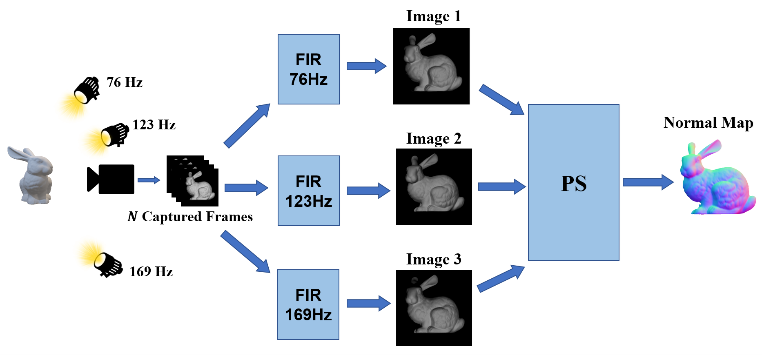

# LIVIPS (LIPS)

## introduction

Light Invariant Photometric Stereo (LIPS) is an imaging setup that enables unsynchronized Photometric Stereo (PS) for Lambertian objects based on modulated light sources. Knowing the specific frequency of the modulated light source allows to filter out any other light in the scene. This creates an image that depends only on the particular light source while ignoring the ambient light. Moreover, if the scene is illuminated by multiple modulated sources with different frequencies, repeating this process for every frequency will produce a sequence of images with the corresponding illumination. This sequence is then used as an input to the PS algorithm for 3D reconstruction.

## Content

This project is arranged as follows:

- The "Image Processing" folder contains functions for basic image processing operations. 
- "LIVItools"  contains functions for signal processing operations on videos.
- "PSBox-v0.3.1" contains the Matlab toolbox [PSbox](https://www.mathworks.com/matlabcentral/fileexchange/45250-psbox) By Ying Xiong.
- "calibrate" contains scripts for calibrating the prototype using a chrome ball.
- "evaluate" contains scripts and functions for evaluating the results compare the ground truth.
- "hardware" contains the HDL files for the FPGA.
- "led control" contains GUI that controls the lights only (without using the camera).
- "scanner" contains scripts to perform a 3D scan using modulated light sources ("LIVI") or using classic PS ("static"). It also contains a script to perform the algorithm on already taken videos. 
- "simulation" contains scripts and simulations of the system using Mitsuba Renderer. It contains both LIPS simulation ("generic_LIVI_simulation_direct.m") and classical PS simulations ("generic_static_simulation_direct.m"). It also contains a script to perform the algorithm on an already simulated video ("LIVI_from_mov.m")). It also contains a toolbox for exr files by Edgar Velazquez-Armendariz and a toolbox for XML files by W. Falkena, ASTI, TUDelft.

## Instructions

- In order to run the code, you need first to install the following Matlab toolboxes: "signal processing toolbox" and "image processing toolbox".
  For using the prototype, you also need to install: "image acquisition toolbox" and "communications toolbox". In order to perform simulations, you need to install "Mitsuba Renderer 0.5".
- Results of the experiments performed with the prototype can be found in the [link](https://drive.google.com/drive/folders/1jLh_U3X0UWans6-U6xJRCW4SGj4xhrJE?usp=sharing) (including the final results compare to GT and the raw videos). Please copy the "results" directory and locate it in the "scanner" directory.
- Results of the experiments performed with the simulation can be found in the [link](https://drive.google.com/drive/folders/1wr1_BHnlOb9J3UCbUTiUqF9YhQdvPcys?usp=sharing). Please copy the "results" directory and locate it in the "generic" directory.